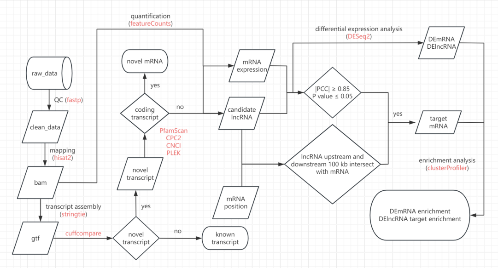

# A tiny bioinformatics and visual tool.

## Dependence of python packages
**python ≥ 3.8<br />
biopython ≥ 1.79<br />
fire ≥ 0.6.0<br />
pybioinformatic == 1.0.9<br />
requests ≥ 2.26.0<br />
scipy ≥ 1.9.0<br />
venn ≥ 0.1.3<br />**
## Dependency of other software
**bedtools: https://github.com/arq5x/bedtools2<br />
blast+: https://ftp.ncbi.nlm.nih.gov/blast/executables/blast+/LATEST/<br />
bwa: https://github.com/lh3/bwa<br />
CNCI: https://github.com/www-bioinfo-org/CNCI<br />
CPC2: https://github.com/gao-lab/CPC2_standalone<br />
cufflinks: https://github.com/cole-trapnell-lab/cufflinks<br />
fastp: https://github.com/OpenGene/fastp<br />
featureCounts: https://subread.sourceforge.net/<br />
gatk: https://github.com/broadinstitute/gatk<br />
hisat2: https://daehwankimlab.github.io/hisat2/<br />
PfamScan: https://github.com/aziele/pfam_scan<br />
PLEK: https://sourceforge.net/projects/plek2/<br />
samtools: https://github.com/samtools/samtools<br />
seqkit: https://github.com/shenwei356/seqkit<br />
stringtie: https://github.com/gpertea/stringtie**

## Getting started
```shell
git clone https://github.com/wenlinXu-njfu/biopy.git
python biopy/configure.py
export PYTHONPATH=$PATH:/your/path/biopy
export PATH=$PATH:/your/path/biopy/bin
```

## Issue
### ImportError: libffi.so.7: cannot open shared object file: No such file or directory
```shell
# First use the following command to verify that the file exists in that path.
ls /usr/lib/x86_64-linux-gnu/libffi.so.7

# If libffi.so.6 is present on your system but libffi.so.7 is missing, you can try creating a soft link to an existing libffi.so.6 file.
ln -s /usr/lib/x86_64-linux-gnu/libffi.so.6 /usr/lib/x86_64-linux-gnu/libffi.so.7

# You can also install libffi7 with sudo grant.
sudo apt-get install libffi7
```

## Example
### Run commands concurrently.
```shell
for i in `ls dir`;
do echo blastn -query dir/$i -db genome.fa -outfmt 6 -out "$i.blastn.xls";
done | exec_cmds -f - -n 10
```

### Protein translation
```shell
ORF_finder \
    -l 30 \
    -n 10 \
    -Fc \
    -log biopy/test_data/ORF_finder/ORF_finder.log \
    -o biopy/test_data/ORF_finder/ \
    biopy/test_data/ORF_finder/Ptrichocarpa_533_v4.1.cds.fa.gz
```
### Search protein motif
```shell
ORF_finder \
    -l 1 \
    -n 10 \
    -F \
    -log biopy/test_data/ORF_finder/ORF_finder.log \
    biopy/test_data/ORF_finder/Ptrichocarpa_533_v4.1.cds.fa.gz | \
    motif_finder -m '(?:W[A-Z]{18,20}){2,}[WFIL][A-Z]{18,20}' -Fq -
```

### lncRNA and target prediction.
```shell
ssRNA-seq_pipeline config.yaml
```

#### config.yaml file content:
```yaml
input:
  sample_info: "/your/path/to/sample.info.xls"  # Sample information file.
  ref_genome: "/your/path/to/genome.fa"  # Reference genome fasta file.
  ref_genome_gff: "/your/path/to/genome.gff"  # Reference genome gff annotation file.
  enrich_anno_file: "/your/path/to/KEGG_anno.xls"  # GO or KEGG annotation file for enrichment analysis. (ID\tTerm\tDescription, eg. Pe.001G000600.2\tGO:0005886\tplasma membrane)

output:
  dir: "/your/path/to/out_dir"

global_params:
  num_threads: 10  # The number of threads for each sample.
  num_processing: 5  # The number of processing. It means how many samples are analyzed in parallel at a time.

featureCounts_params:
  feature_type: "exon"  # FeatureCounts -t option. Each entry in the provided gff annotation file is taken as a feature (e.g. an exon).
  mate_feature: "transcript_id"  # FeatureCounts -g option. A meta-feature is the aggregation of a set of features (e.g. a gene).

CNCI_params:
  CNCI_module: "pl"  # CNCI -m option. Specify classification model. (pl for plant, ve for vertebrate)

pfamscan_params:
  pfamscan_database: "/your/path/to/Pfam"  # PfamScan -dir option. Directory location of Pfam files.

lncRNA_target_prediction_params:
  lncRNA_min_exp: 0.5  # The minimum lncRNA expression filtering parameters for calculating co-expression.
  mRNA_min_exp: 0.000001  # The minimum mRNA expression filtering parameters for calculating co-expression.
  r: 0.85  # Pearson correlation of co-expression.
  FDR: 0.05  # FDR of co-expression.
  q_value: 0.05  # q value of co-expression.
  distance: 100000  # Maximum distance between lncRNA and mRNA.

DESeq2_params:
  padj: 0.05  # Adjusted p-value.
  log2FoldChange: 1.5  # log2FoldChange.

clusterProfiler_params:
  pvalueCutoff: 0.05  # p value Cutoff.
  pAdjustMethod: 'BH'  # Multiple hypothesis testing methods.
  qvalueCutoff: 0.2  # q value cutoff.
```
- The first four columns of sample.info.xls file (TAB delimiter) must be Sample_name, Read1_path, Read2_path and Comparative_combination (for differential expression analysis).<br />
```
+-----------+-------------------------------------+-------------------------------------+-------------------------------------------+
| sample1_1 | /your/path/to/sample1_1/read1.fq.gz | /your/path/to/sample1_1/read2.fq.gz | sample2_vs_sample1:C;sample3_vs_sample1:C |
| sample1_2 | /your/path/to/sample1_2/read1.fq.gz | /your/path/to/sample1_2/read2.fq.gz | sample2_vs_sample1:C;sample3_vs_sample1:C |
| sample2_1 | /your/path/to/sample2_1/read1.fq.gz | /your/path/to/sample2_1/read2.fq.gz | sample2_vs_sample1:T                      |
| sample2_2 | /your/path/to/sample2_2/read1.fq.gz | /your/path/to/sample2_2/read2.fq.gz | sample2_vs_sample1:T                      |
| sample3_1 | /your/path/to/sample3_1/read1.fq.gz | /your/path/to/sample3_1/read2.fq.gz | sample3_vs_sample1:T                      |
| sample3_2 | /your/path/to/sample3_2/read1.fq.gz | /your/path/to/sample3_2/read2.fq.gz | sample3_vs_sample1:T                      |
+-----------+-------------------------------------+-------------------------------------+-------------------------------------------+
```

#### Dependency software
Make sure the R interpreter for the current environment variable have installed DESeq2 and clusterProfiler packages.<br />
Make sure these commands can be found in your environment variable:
- fastp
- histat2
- samtools
- stringtie
- cuffcompare
- featureCounts
- pfam_scan.pl
- CPC2.py
- CNCI.py
- PLEK
#### How it works


### Genotype consistency calculation.
```shell
gt_kit gs \
    -i biopy/test_data/GT/GT.xls.gz \
    -I biopy/test_data/GT/GT.xls.gz \
    --database-compare \
    -o biopy/test_data/GT/
```


### Plot gene structure.
```shell
plot gene_structure \
    -i biopy/test_data/gene_structure/Ptc.gff3.gz \
    -o biopy/test_data/gene_structure/mRNA_structure.png
```


### Plot circos figure.
```shell
plot circos \
    -c biopy/test_data/circos/Ptc_chr_len.txt \
    -d biopy/test_data/circos/gene_density.txt \
    -s biopy/test_data/circos/stat.txt \
    -l biopy/test_data/circos/link.txt \
    -o biopy/test_data/circos/circos.png
```


### Plot chromosome distribution.
```shell
plot chr_distribution \
    -i biopy/test_data/chr_distribution/snp.ref.xls \
    -l biopy/test_data/chr_distribution/chr_len.xls \
    -w 100000 \
    -n 4 \
    -c RdYlGn \
    -r \
    -o biopy/test_data/chr_distribution/snp.distribution.png
```

