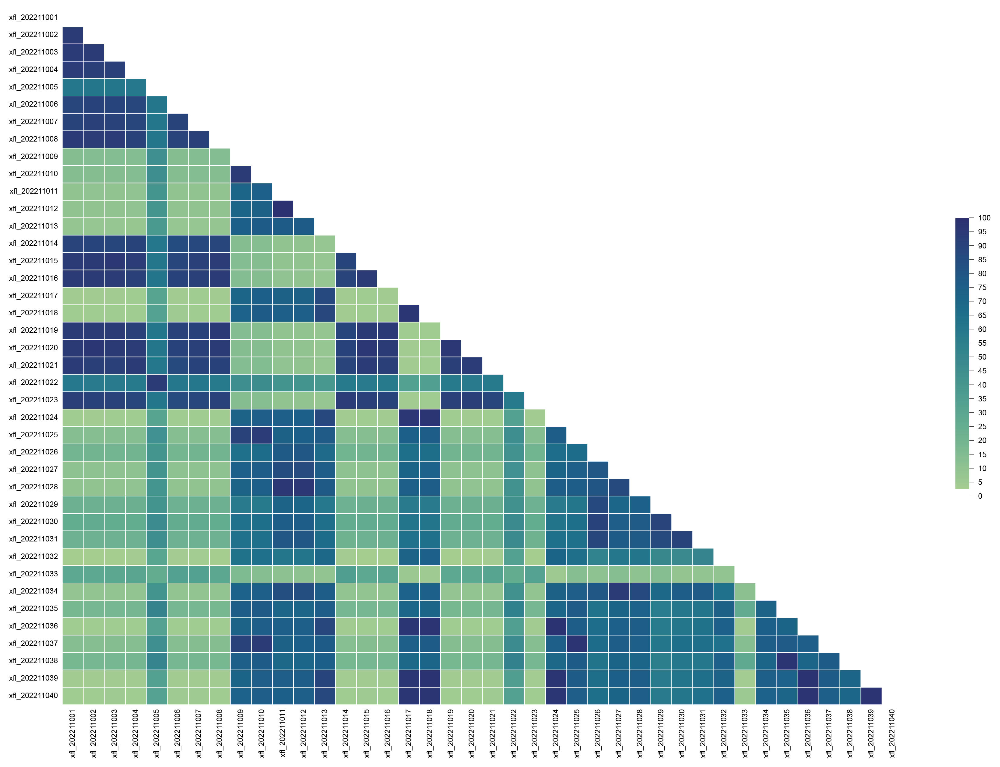
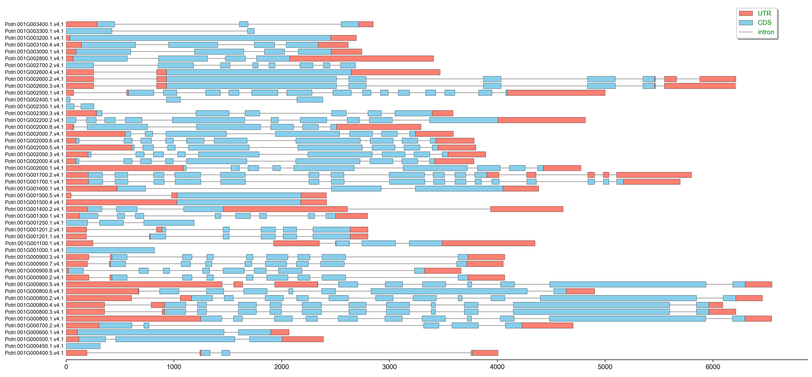
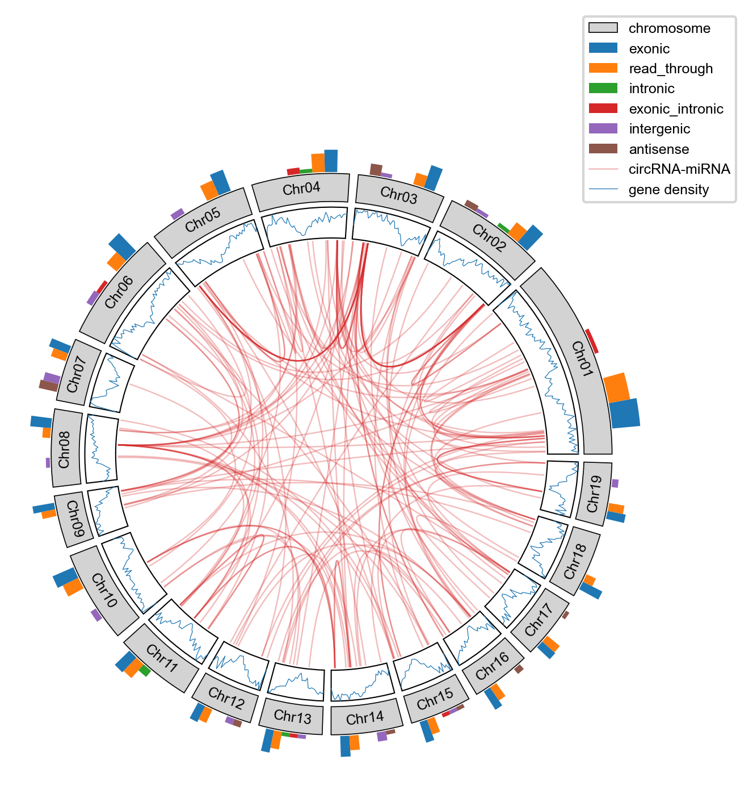
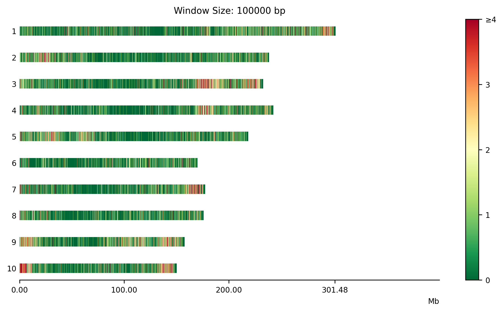

# A tiny bioinformatics and visual tool.

## Dependency of python packages
**python ≥ 3.8.5<br />
click ≥ 8.1.7<br />
fire ≥ 0.6.0<br />
matplotlib ≥ 3.5.1<br />
natsort ≥ 8.4.0<br />
numpy ≥ 1.23.1<br />
openpyxl ≥ 3.0.9<br />
pandas ≥ 2.0.3<br />
requests ≥ 2.26.0<br />
scipy ≥ 1.9.0<br />
seaborn ≥ 0.11.2<br />
tqdm ≥ 4.62.3<br />
venn ≥ 0.1.3<br />
xlsxwriter ≥ 3.1.9<br />**

## Dependency of other software
**blast+ for circRNA flanking sequence analyse.<br />
pfamscan for batch perform pfamscan.<br />**

## Getting started
```shell
git clone https://github.com/wenlinXu-njfu/biopy.git
python biopy/configure.py
export PYTHONPATH=$PATH:/home/user/software/biopy
export PATH=$PATH:/home/user/software/biopy/bin
```

## Example
### Run commands concurrently.
```shell
for i in `ls dir`;
do echo blastn -query dir/$i -db genome.fa -out "$i.blastn.xls";
done | exec_cmds -f - -n 10
```

### Protein translation
```shell
ORF_finder \
-l 30 \
-n 10 \
-pc \
-log biopy/test_data/ORF_finder/ORF_finder.log \
-o biopy/test_data/ORF_finder/ \
biopy/test_data/ORF_finder/Ptrichocarpa_533_v4.1.cds.fa.gz
```

### Genotype consistency calculation.
```shell
gt_kit gs \
-i biopy/test_data/GT/GT.xls.gz \
-I biopy/test_data/GT/GT.xls.gz \
--database-compare \
-o biopy/test_data/GT/
```


### Plot gene structure.
```shell
plot gene_structure \
-i biopy/test_data/gene_structure/Ptc.gff3.gz \
-o biopy/test_data/gene_structure/mRNA_structure.png
```


### Plot circos figure.
```shell
plot circos \
-c biopy/test_data/circos/Ptc_chr_len.txt \
-d biopy/test_data/circos/gene_density.txt \
-s biopy/test_data/circos/stat.txt \
-l biopy/test_data/circos/link.txt \
-o biopy/test_data/circos/circos.png
```


### Plot chromosome distribution.
```shell
plot chr_distribution \
-i biopy/test_data/chr_distribution/snp.ref.xls \
-l biopy/test_data/chr_distribution/chr_len.xls \
-w 100000 \
-n 4 \
-cmap RdYlGn \
-o biopy/test_data/chr_distribution/snp.distribution.png
```

