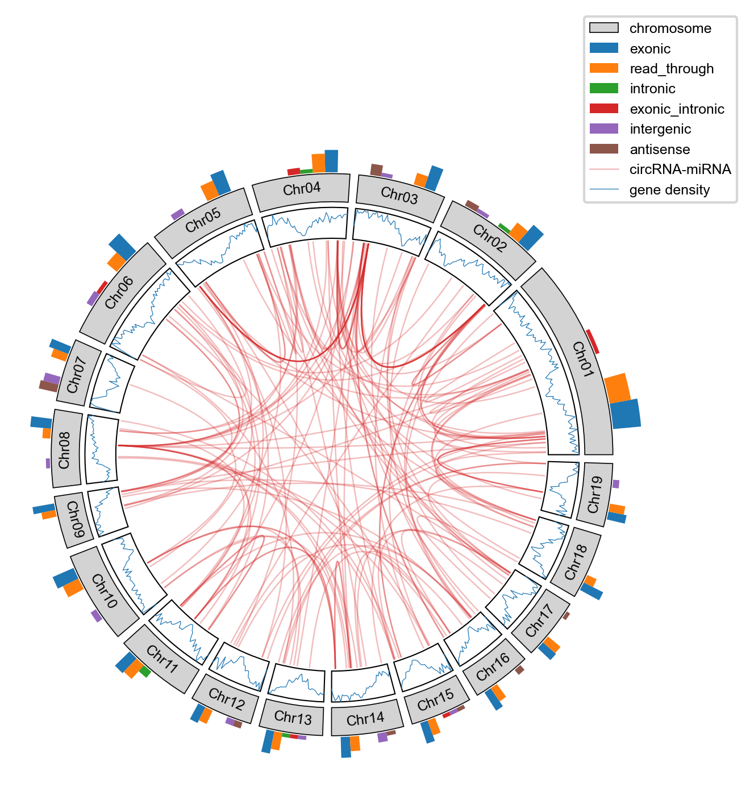

# A tiny bioinformatics and visual tool.

## Dependency of python packages
**python ≥ 3.8.5 
click ≥ 8.1.7 
natsort ≥ 8.4.0 
matplotlib ≥ 3.5.1 
numpy ≥ 1.23.1 
openpyxl ≥ 3.0.9 
pandas ≥ 1.4.2 
requests ≥ 2.26.0 
scipy ≥ 1.9.0 
seaborn ≥ 0.11.2 
tqdm ≥ 4.62.3 
venn ≥ 0.1.3 **

## Dependency of other software
**blast+ for circRNA flanking sequence analyse. 
pfamscan for batch perform pfamscan. **

## Getting started
**git clone https://github.com/wenlinXu-njfu/biopy_v1.1.0.git  
python biopy_v1.1.0/configure.py 
export PYTHONPATH=$PATH:/home/user/software/biopy_v1.1.0 
export PATH=$PATH:/home/user/software/biopy_v1.1.0/bin **

## example
**plot circos \   -c biopy/plot_lib/circos/test_data/Ptc_chr_len.txt \   -d biopy/plot_lib/circos/test_data/gene_density.txt \   -s biopy/plot_lib/circos/test_data/stat.txt \   -l biopy/plot_lib/circos/test_data/link.txt \   -o biopy/plot_lib/circos/test_data/circos.png**

