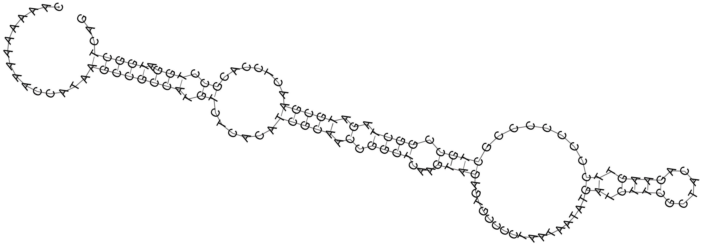
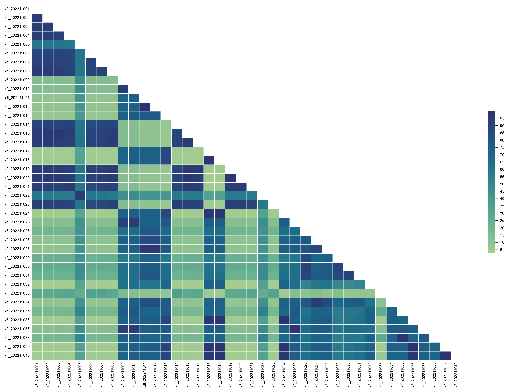

# A tiny bioinformatics and visual tool.

## Dependence of python packages
**python ≥ 3.8<br />
biopython ≥ 1.79<br />
fire ≥ 0.6.0<br />
pybioinformatic == 0.1.0<br />
requests ≥ 2.26.0<br />
scipy ≥ 1.9.0<br />
venn ≥ 0.1.3<br />**
## Dependency of other software
**bedtools: https://github.com/arq5x/bedtools2<br />
bwa: https://github.com/lh3/bwa<br />
CNCI: https://github.com/www-bioinfo-org/CNCI<br />
CPC2: https://github.com/gao-lab/CPC2_standalone<br />
cufflinks: https://github.com/cole-trapnell-lab/cufflinks<br />
fastp: https://github.com/OpenGene/fastp<br />
featureCounts: https://subread.sourceforge.net/<br />
gatk: https://github.com/broadinstitute/gatk<br />
hisat2: https://daehwankimlab.github.io/hisat2/<br />
PfamScan: https://github.com/aziele/pfam_scan<br />
PLEK: https://sourceforge.net/projects/plek2/<br />
samtools: https://github.com/samtools/samtools<br />
seqkit: https://github.com/shenwei356/seqkit<br />
stringtie: https://github.com/gpertea/stringtie**

## Getting started
```shell
git clone https://github.com/wenlinXu-njfu/biopy.git
python biopy/configure.py
export PYTHONPATH=$PATH:/your/path/biopy
export PATH=$PATH:/your/path/biopy/bin
```

## Issue
### ImportError: libffi.so.7: cannot open shared object file: No such file or directory
```shell
# First use the following command to verify that the file exists in that path.
ls /usr/lib/x86_64-linux-gnu/libffi.so.7

# If libffi.so.6 is present on your system but libffi.so.7 is missing, you can try creating a soft link to an existing libffi.so.6 file.
ln -s /usr/lib/x86_64-linux-gnu/libffi.so.6 /usr/lib/x86_64-linux-gnu/libffi.so.7

# You can also install libffi7 with sudo grant.
sudo apt-get install libffi7
```

## Example
### Run commands concurrently.
```shell
for i in `ls dir`;
do echo blastn -query dir/$i -db genome.fa -out "$i.blastn.xls";
done | exec_cmds -f - -n 10
```

### Protein translation
```shell
ORF_finder \
-l 30 \
-n 10 \
-Fc \
-log biopy/test_data/ORF_finder/ORF_finder.log \
-o biopy/test_data/ORF_finder/ \
biopy/test_data/ORF_finder/Ptrichocarpa_533_v4.1.cds.fa.gz
```
### Search protein motif
```shell
ORF_finder \
-l 1 \
-n 10 \
-F \
-log biopy/test_data/ORF_finder/ORF_finder.log \
biopy/test_data/ORF_finder/Ptrichocarpa_533_v4.1.cds.fa.gz | \
motif_finder -m '(?:W[A-Z]{18,20}){2,}[WFIL][A-Z]{18,20}' -q -
```

### RNA secondary structure prediction.
```python
from pybioinformatic import Nucleotide

# Generate random nucleic acid sequence.
random_nucl = Nucleotide.random_nucl(name='demo', length=[100, 150], bias=1.0)

# Secondary structure prediction
ss, mfe = random_nucl.predict_secondary_structure('biopy/test_data/RNA_structure/structure.ps')
print(ss, mfe, sep='\n')
```
```
>demo length=135
CAAAAAAAAACCATAAGCCGCCATGTCTCACATCGCAACCGGCTCAAGTAGAGTGCCCCTAATAATATGATCTTCGCTACAGAAGTTCCCCCCCCGCTGCCGGCTAGATGCGAACTCCACGCCTGGATGGCTCAG
...............((((((((.((......(((((.(.((((...((((.................((.((((......)))).))........)))).)))).).))))).......)).))).)))))...
-27.299999237060547
```


### lncRNA and target prediction.
```shell
ssRNA-seq_pipeline \
-l sample.info.xls \
-r genome.fa \
-g genome.gff3 \
-f exon \
-c transcript_id \
-m pl \
-d PfamScanDataBase \
-t 15 \
-p 6 \
-o .
```
```
# Options explain:
-l: The first two columns of sample.info.xls file must be Sample_name and Fastq_path.
-r: Referenece genome fasta file, please build hisat2 index before runing.
-g: Referenece genome annotation gff file.
-f: FeatureCounts -t option.
-c: FeatureCounts -g option.
-m: CNCI -m option.
-d: PfamScan -dir option.
-t: Number of threads for each sample.
-p: Number of processing. It means how many sample are analyzed in parallel.
-o: Output path.

# Dependency software
Make sure these command can be found in your environment variable:
fastp, histat2, samtools, stringtie, cuffcompare, featureCounts, pfam_scan.pl, CPC2.py, CNCI.py, and PLEK
```


### Genotype consistency calculation.
```shell
gt_kit gs \
-i biopy/test_data/GT/GT.xls.gz \
-I biopy/test_data/GT/GT.xls.gz \
--database-compare \
-o biopy/test_data/GT/
```


### Plot gene structure.
```shell
plot gene_structure \
-i biopy/test_data/gene_structure/Ptc.gff3.gz \
-o biopy/test_data/gene_structure/mRNA_structure.png
```


### Plot circos figure.
```shell
plot circos \
-c biopy/test_data/circos/Ptc_chr_len.txt \
-d biopy/test_data/circos/gene_density.txt \
-s biopy/test_data/circos/stat.txt \
-l biopy/test_data/circos/link.txt \
-o biopy/test_data/circos/circos.png
```


### Plot chromosome distribution.
```shell
plot chr_distribution \
-i biopy/test_data/chr_distribution/snp.ref.xls \
-l biopy/test_data/chr_distribution/chr_len.xls \
-w 100000 \
-n 4 \
-c RdYlGn \
-o biopy/test_data/chr_distribution/snp.distribution.png
```

